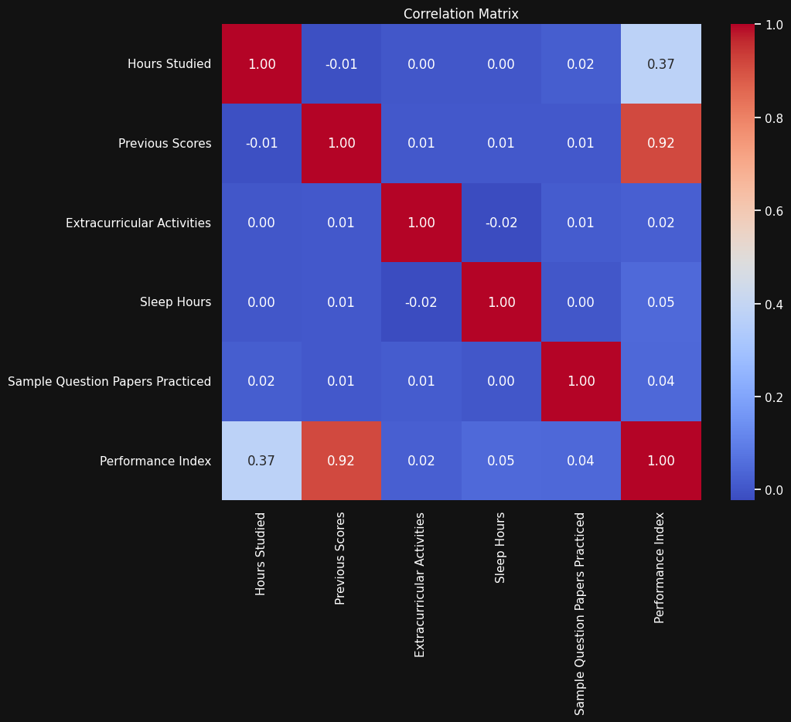
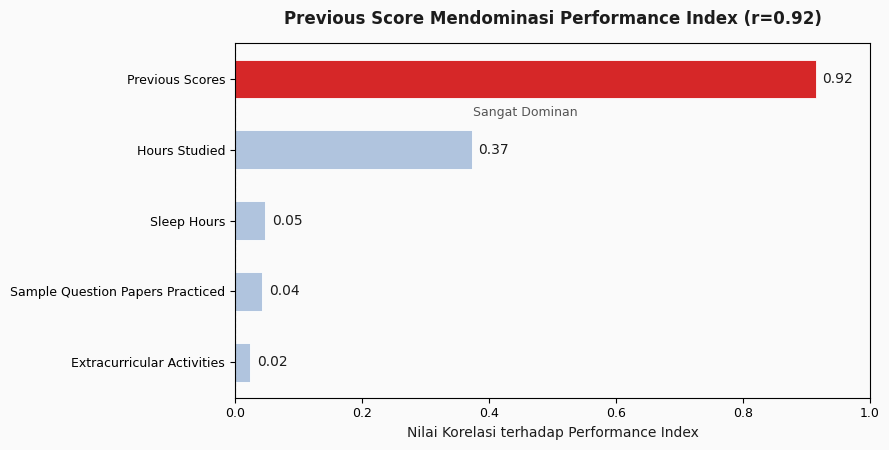
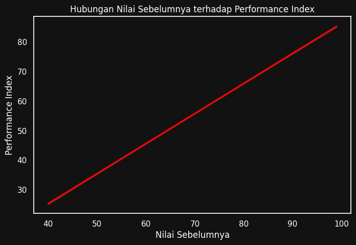
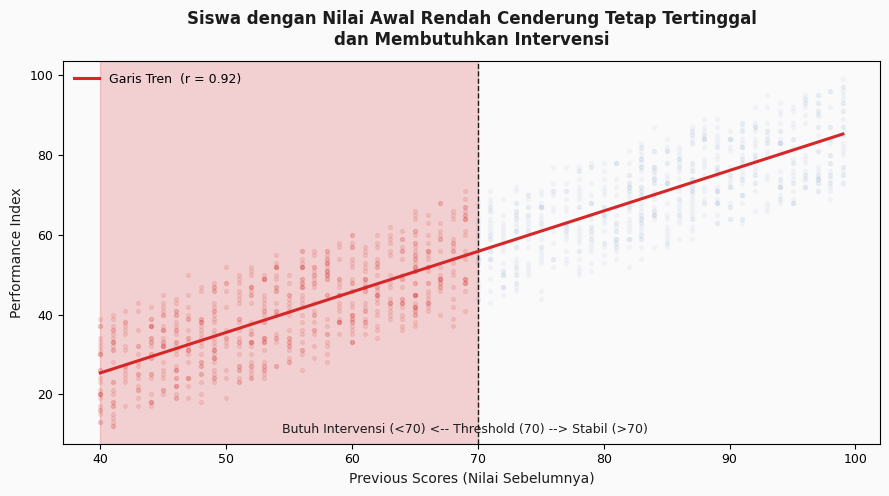
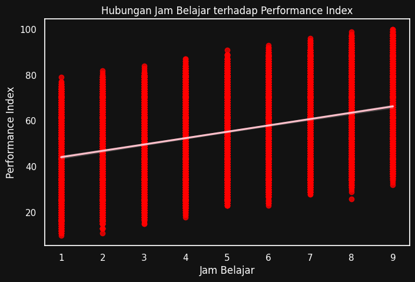
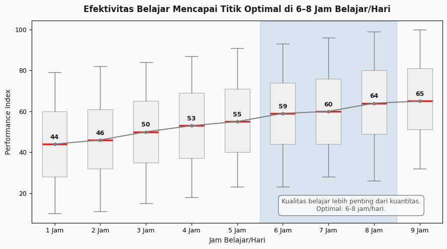

# Student Performance Analysis & Visual Storytelling

## Deskripsi Proyek

Proyek ini bertujuan untuk menganalisis faktor-faktor yang mempengaruhi performa akademik siswa menggunakan pendekatan Exploratory Data Analysis (EDA) serta mengubah hasil analisis menjadi visualisasi yang lebih komunikatif melalui proses Visual Makeover.

Dataset yang digunakan berasal dari perusahaan EdTech dan berisi 10.000 data siswa dengan berbagai faktor yang diduga mempengaruhi performa akademik, seperti jam belajar, nilai sebelumnya, jam tidur, aktivitas ekstrakurikuler, dan jumlah latihan soal.

Melalui analisis ini, perusahaan dapat memahami faktor-faktor utama yang mempengaruhi performa siswa serta merancang strategi intervensi pembelajaran yang lebih efektif dan berbasis data.

---

## Tujuan Analisis

* Mengidentifikasi faktor utama yang mempengaruhi Performance Index siswa.
* Mengetahui hubungan antar variabel akademik dan non-akademik.
* Menemukan kelompok siswa yang membutuhkan intervensi pembelajaran.
* Mengubah hasil analisis menjadi visualisasi yang lebih mudah dipahami oleh stakeholder non-teknis.
* Memberikan rekomendasi bisnis untuk platform EdTech.

---

## Dataset

Dataset terdiri dari 10.000 data siswa dengan variabel:

| Variabel                         | Deskripsi                     |
| -------------------------------- | ----------------------------- |
| Hours Studied                    | Jam belajar siswa             |
| Previous Scores                  | Nilai akademik sebelumnya     |
| Sleep Hours                      | Jam tidur siswa               |
| Extracurricular Activities       | Keikutsertaan ekstrakurikuler |
| Sample Question Papers Practiced | Jumlah latihan soal           |
| Performance Index                | Indeks performa siswa         |

---

## Tools yang Digunakan

* Python
* Pandas
* NumPy
* Matplotlib
* Seaborn
* Google Colab

---

# Tahap 1 — Exploratory Data Analysis (EDA)

## Statistical Profiling

Analisis statistik menunjukkan bahwa:

* Rata-rata Performance Index berada pada angka 55.
* Terdapat variasi performa yang cukup besar antar siswa.
* Previous Scores memiliki variasi yang tinggi dan menjadi kandidat faktor utama yang mempengaruhi performa.
* Jam belajar siswa relatif seragam dengan rata-rata sekitar 5 jam per hari.

---

## Correlation Analysis

Analisis korelasi menunjukkan bahwa:

| Variabel                         | Korelasi terhadap Performance Index |
| -------------------------------- | ----------------------------------- |
| Previous Scores                  | 0.92                                |
| Hours Studied                    | Lebih rendah                        |
| Sleep Hours                      | Lebih rendah                        |
| Sample Question Papers Practiced | Lebih rendah                        |
| Extracurricular Activities       | Sangat rendah                       |

### Insight

Previous Scores memiliki korelasi sangat kuat terhadap Performance Index (r = 0.92).

Hal ini menunjukkan bahwa kemampuan akademik sebelumnya menjadi faktor dominan yang menentukan performa siswa saat ini.

---

## Previous Scores vs Performance Index

Visualisasi menunjukkan hubungan linear positif yang sangat kuat antara nilai sebelumnya dan performa siswa.

### Insight

Siswa dengan nilai akademik awal yang tinggi cenderung mempertahankan performa tinggi pada periode berikutnya.

Sebaliknya, siswa dengan nilai awal rendah berisiko tetap tertinggal apabila tidak diberikan intervensi khusus.

---

## Hours Studied vs Performance Index

Meskipun terdapat hubungan positif antara jam belajar dan performa siswa, penyebaran data menunjukkan bahwa peningkatan jam belajar tidak selalu menghasilkan peningkatan performa yang sebanding.

### Insight

Kuantitas belajar bukan satu-satunya faktor yang menentukan keberhasilan siswa. Kualitas belajar kemungkinan memiliki peran yang lebih penting.

---

## Extracurricular Activities Analysis

Perbandingan siswa yang mengikuti ekstrakurikuler dan yang tidak mengikuti menunjukkan perbedaan rata-rata performa yang relatif kecil.

### Insight

Keikutsertaan ekstrakurikuler tidak secara langsung meningkatkan performa akademik, tetapi dapat menjadi indikator kemampuan manajemen waktu dan motivasi belajar yang lebih baik.

---

# Tahap 2 — Visual Makeover

Setelah proses EDA selesai, dilakukan redesign visualisasi untuk meningkatkan efektivitas komunikasi insight kepada stakeholder non-teknis.

---

## Visualisasi 1 — Faktor Dominan Penentu Performa Siswa

### Sebelum

* Menggunakan heatmap korelasi standar.
* Banyak informasi yang tidak relevan dengan tujuan bisnis.
* Sulit mengidentifikasi faktor terpenting.

### Sesudah

* Menggunakan horizontal bar chart.
* Menyoroti Previous Scores dengan warna berbeda.
* Fokus langsung pada faktor paling berpengaruh.

### Insight

Nilai akademik sebelumnya menjadi faktor dominan yang mempengaruhi Performance Index siswa.

---

## Visualisasi 2 — Identifikasi Siswa yang Membutuhkan Intervensi

### Sebelum

* Hanya menampilkan garis regresi.
* Tidak menunjukkan segmentasi siswa.

### Sesudah

* Menampilkan scatter plot dengan segmentasi zona.
* Mengidentifikasi kelompok siswa yang membutuhkan perhatian khusus.

### Insight

Siswa dengan Previous Score rendah memiliki risiko lebih tinggi untuk tetap tertinggal apabila tidak diberikan intervensi yang sesuai.

---

## Visualisasi 3 — Efektivitas Jam Belajar

### Sebelum

* Scatter plot dengan 10.000 titik.
* Sulit membaca pola distribusi data.

### Sesudah

* Menggunakan boxplot berdasarkan kelompok jam belajar.
* Menampilkan median performa secara jelas.
* Menunjukkan area jam belajar optimal.

### Insight

Peningkatan performa siswa cenderung melandai setelah 6–8 jam belajar per hari.

---

# Business Insight

## Temuan Utama

### 1. Previous Score Menjadi Faktor Dominan

Nilai akademik sebelumnya memiliki korelasi sangat tinggi terhadap performa siswa saat ini.

### 2. Kesenjangan Akademik Berpotensi Membesar

Siswa yang memiliki kemampuan awal rendah cenderung tetap tertinggal apabila mendapatkan perlakuan yang sama dengan siswa lain.

### 3. Jam Belajar Memiliki Diminishing Return

Belajar lebih lama tidak selalu menghasilkan performa yang lebih baik.

---

# Rekomendasi Bisnis

### Adaptive Learning Path

Membangun sistem pembelajaran adaptif yang secara khusus menargetkan siswa dengan Previous Score rendah.

### Diagnostic Assessment

Melakukan evaluasi awal untuk mengelompokkan siswa berdasarkan tingkat kesiapan belajar.

### Personalized Learning

Memberikan materi dan target belajar yang berbeda untuk setiap kelompok siswa.

### Fokus pada Learning Quality

Mengubah KPI pembelajaran dari "lama belajar" menjadi "kualitas sesi belajar", seperti:

* Tingkat penyelesaian latihan
* Akurasi jawaban
* Konsistensi belajar

---

# Kesimpulan

Analisis menunjukkan bahwa Previous Scores merupakan faktor paling berpengaruh terhadap Performance Index siswa. Selain itu, peningkatan jam belajar memiliki batas efektivitas tertentu sehingga kualitas belajar menjadi lebih penting dibandingkan durasi belajar semata.

Melalui visualisasi yang lebih komunikatif dan insight-driven, hasil analisis dapat dipahami dengan lebih cepat oleh stakeholder sehingga mendukung pengambilan keputusan yang lebih tepat dalam pengembangan strategi pembelajaran pada platform EdTech.

---

# Skill yang Ditunjukkan

* Exploratory Data Analysis (EDA)
* Statistical Profiling
* Correlation Analysis
* Data Visualization
* Visual Storytelling
* Business Insight Generation
* Data Cleaning
* Python Analytics
* Decision Support Analysis

---

## Author

**Shofia Nabila**
Universitas Pendidikan Indonesia
Data Analyst Portfolio
